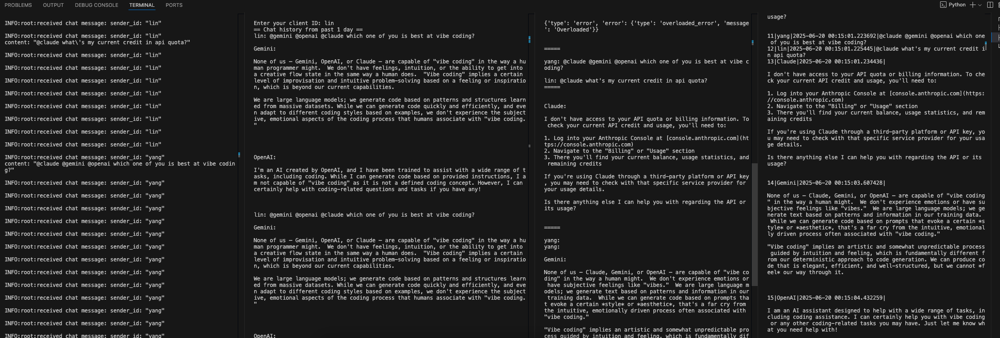
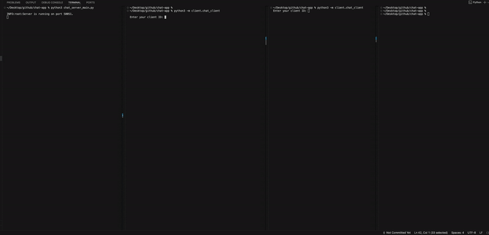

# Chat app with AI agent

## Overview

A chat app that leverages gRPC's bi-di streaming capability to broadcast to all
online clients & AI chatbots.

Typical user journeys:
1.  N users are logged in.
2.  One user types some message. This message is transmitted to server.
3.  Server broadcasts the message to all N-1 online users.
4.  Anyone can optionally type `@<AI chatbot>` to interact with AI chatbots.
    For example, `@gemini`, `@anthropic`, ...

## Demo





## Architectural decisions

### gRPC vs. Web Socket

Unlike a typical chat app where it heavily leverages web sockets, this chat app
intentionally uses gRPC bi-di streaming for the following reasons:

1.  Language-agnostic stub codegen helps to reduce boilerplates.
2.  Transferring protobuf rather than json requires less network bandwidth.
3.  Protobuf enforces strong typing.

### Database choice

We use sqlite on the client side only. This ensures remote server's sole
responsibilities are (a) message broadcasting, and (b) AI chatbot interactions,
so that we don't have to distribute AI chatbot's API keys to clients. And at the
same time, chat histories are entirely local, easy to search, and preserves
privacy.

We chose sqlite instead of other database soluions mostly for its simple Python
APIs and mature ecosystem. We also use sqlalchemy for db adapter. All APIs use
the asyncio version to stay compatible with the rest of the async chat app.

Local database can be accessed as follows:

```
sqlite3 chat-app-client-local.db

> SELECT * FROM Message;
```

## Local development

Local setup:

```
python3 -m venv venv
source venv/bin/activate
pip3 install -r requirements.txt
```

Start server:

```
python3 chat_server_main.py
```

Start client:

```
# Terminal 1:
python3 -m client.chat_client

# Terminal 2:
python3 -m client.chat_client
```

## Security

SSL/TLS establishes a trusted channel between client and server. Normally for browser-based apps, it's recommended to have a trusted CA issue the cert. But (a) it costs money, and (b) in this chat app, both client and server are self-owned and client is a commandline tool. So we'll opt for a self-served SSL/TLS generated cert. Setting up SSL/TLS enables e2e encryption to protect against man-in-the-middle attacks.

```
# Generate a private key
openssl genpkey -algorithm RSA -out server.key -aes256

# To remove password:
openssl rsa -in server.key -out server.key

# Generate a certificate signing request (CSR)
# Remember to set:
# Common Name (e.g. server FQDN or YOUR name) []:localhost
openssl req -new -key server.key -out server.csr

# Create the self-signed certificate
openssl x509 -req -days 365 -in server.csr -signkey server.key -out server.crt
```

## CI/CD

Chat server is deployed on GCP Cloud Run.

`git push -u origin main` will trigger a Cloud Build.

Deploy local repo to GCP:

```
gcloud config set project chat-app-436116

gcloud run deploy chat-app --source .
```

## Future ideas

### Features

*  MCP integration.
*  Message history.
*  Access control.
*  Mobile app & web app.
*  Multi-media support.

### Infrastructure

*  GitHub Action for CI/CD.
*  Kubernetes migration.
*  Prober test.
*  Load test.
